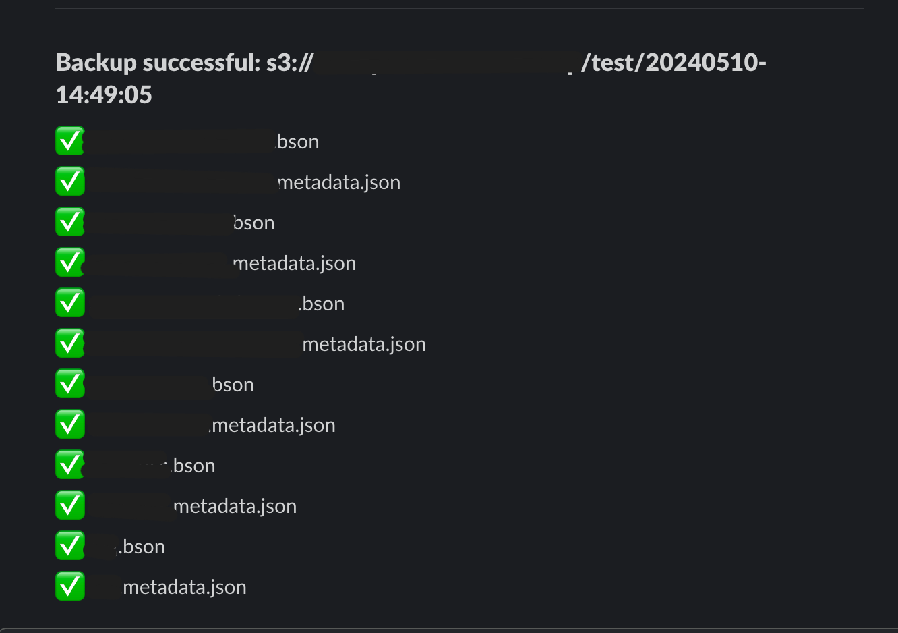

# mongo-backup-manager

---

## environment

| 환경변수              | 설명                         | 예시                                                                      | 필수 |
| --------------------- | ---------------------------- | ------------------------------------------------------------------------- | ---- |
| BACKUP_PREFIX         | 백업될 데이터의 prefix       | myservice-mongo-backup                                                    | O    |
| BACKUP_DIR            | mongodump 될 최상위 디렉토리 | backup                                                                    | X    |
| MONGO_URI             | mongodb uri                  | mongodb://localhost:30001,localhost:30002,localhost:30003/?replicaSet=rs0 | O    |
| MONGO_DB              | mongodb database             | my-test-db                                                                | O    |
| AWS_REGION            | 리전                         | ap-northeast-2                                                            | O    |
| AWS_BUCKET            | 버킷 명                      | myservice-production-backup                                               | O    |
| AWS_ACCESS_KEY        | access key id                | < ACCESS >                                                                | O    |
| AWS_SECRET_ACCESS_KEY | secret access key id         | < SECRET >                                                                | O    |
| SLACK_BOT_TOKEN       | 슬랙 bot token               | < BOT_TOKEN >                                                             | X    |
| SLACK_CHANNEL_ID      | 슬랙 채널 ID                 | < CHANNEL_ID >                                                            | X    |

## slack

백업이 완료되면 슬랙으로 알림을 받을 수 있습니다.

### 주의사항

> 슬랙 설정은 선택사항이며, 설정하지 않으면 알림을 받지 않습니다.
> SLACK_CHANNEL_ID, SLACK_BOT_TOKEN
> 두 환경변수를 모두 설정해야 Slack 알림을 받을 수 있습니다.

> 워크스페이스에서 app 을 만들고, Slack Bot Token 을 발급받아야 합니다.
> `OAuth & Permissions` 메뉴의 scope 에서 `chat:write` 권한을 추가해야 합니다.

### 메시지가 오지 않는경우

Slack 채널에서 ChatBot 을 초대해야 합니다.

> /invite @YourBotName
